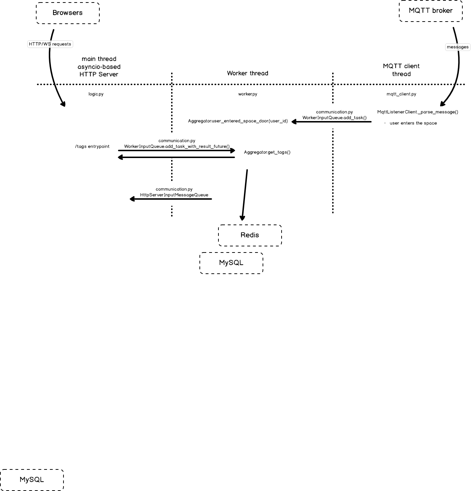

# MakerSpace Leiden Aggregator

- Listens to MQTT messages
- Aggregates useful information (like who is at the space now, what machines are on, etc.)
- Publishes the information live via HTTP and WebSockets

## Architecture

https://balsamiq.cloud/s84bb/pl6cb2r

